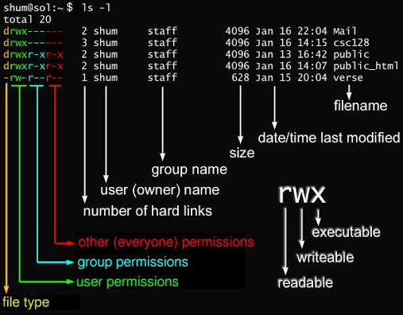

# 常用linux命令

### 查看当前文件夹中文件个数。

    ls|wc - l

### 产看当前文件夹下所有子文件中文件个数。

    for dir in `ls`; do ls $dir |wc -l; done

### 远程传输 scp -r 跨机传输,很快。。。
    
    ##   scp -p source target

    ## 服务器之间传输文件

    scp -r -p 443 /home/dataset/ jack@172.12.13.12:/home/tmp/

    ##   win下 拉服务器上 Linux的文件 
    
    ### **注意下面这条命令是在 cmd 中运行的 ha ha ha，要不会报 ‘no such file’ **  

    scp -P 443 /home/dataset/hello.txt C:/Users/1/Desktop/
    
    ## 然后输密码 有的服务器会修改默认的 22 端口
    

### mv 移动，修改名称. 将/a目录移动到/b

    #  改名
    mv A B

    # 移动加改名 
    mv /a /b/a

### 查看硬件信息  显卡型号查询<http://pci-ids.ucw.cz/mods/PC/10de?action=help?help=pci>
   
    # 硬盘
    df -h 

    # 内存
    cat /proc/meminfo
    free -h 

    # CPU    
    lscpu 

    # GPU
    lspci | grep NVIDIA 
    nvidia-smi

### 后台
    
    ctrl + z 当前进程进入后台
    jobs 查看后台运行的命令
    fg %1 恢复1到前台

### nohup
程序挂后台，并且将log日志输出到a中。
    
    nohup python a.py > a.log &

    
### 查看进程
    
    ps -ef | grep python
    
### 权限 
三个为一组，r w x三个组合。

上图解释：
file type:普通文件

    d 目录
    l 软链接
    c 字符设备（键盘，鼠标）
    b 块文件（硬盘）

rwx作用于文件与目录的不同:

    作用于文件:
    r 代表可读，可以读取，查看
    w 代表可写，可以修改。如果要删除，需要对该文件所在的目录有写权限
    x 代表可执行，可以被执行

	作用于目录:
    r 可以读取，ls查看目录内容
    w 可以修改目录名称，目录内创建和删除文件
    x 可以进入该目录

number of hard links:

	如果是文件，表示硬链接数，如果是目录表示该目录的子目录个数

size:

    如果是文件表示文件大小，如果是目录，固定为4096

### chmod (change mode)

只有文件所有者和超级用户可以修改文件或目录的权限.

    chmod (u g o a) (+ - =) (r w x) (文件名)

    u user 表示该文件的所有者
    g group 表示与该文件的所有者属于同一组( group )者，即用户组
    o other 表示其它用户组
    a all 表示这三者皆是

    +增加权限
    - 撤销权限
    = 设定权限

    r read 表示可读取，对于一个目录，如果没有r权限，那么就意味着不能通过ls查看这个目录的内容。
    w write 表示可写入，对于一个目录，如果没有w权限，那么就意味着不能在目录下创建新的文件。
    x excute 表示可执行，对于一个目录，如果没有x权限，那么就意味着不能通过cd进入这个目录。

例如：

    chmod a + x abc.sh  #  所有用户添加 abc.sh 的执行权限 

    chmod 777 abc.sh   # 将所有权利授予所有用户

    chmod -R 777 /bin # bin目录下的 所有权限赋予所有用户
